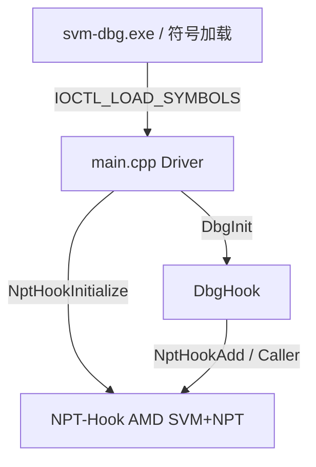
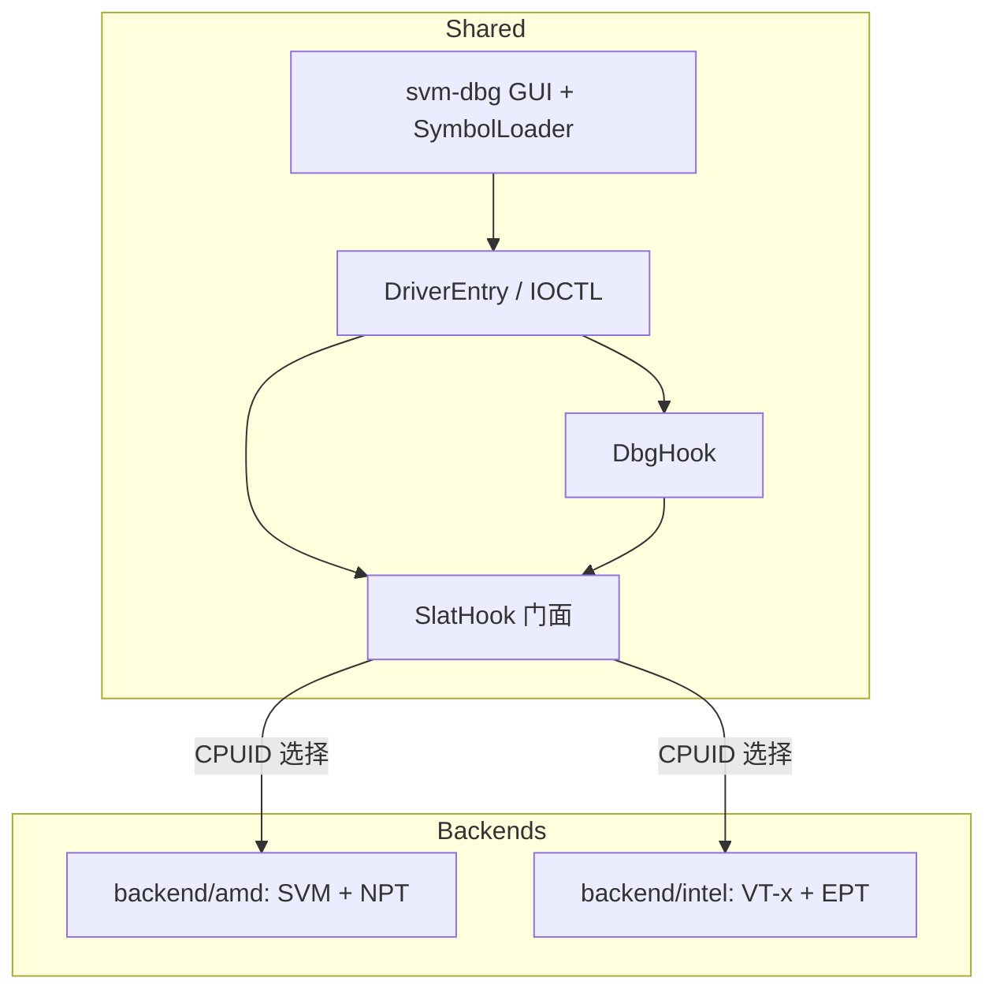

# svm-dbg 双后端设计：Intel EPT + AMD NPT

> 状态：设计草案（Phase 0）  
> 仓库：`zhang2651/svm-dbg`（fork 自 `Qmeimei10086/svm-dbg`）  
> 日期：2026-09-15  
> 决策摘要：双 CPU 支持走 **EPT / NPT（SLAT Hook）**，不继续用 Guest **PTE Hook** 做双平台方案。

---

## 1. 背景与目标

### 1.1 今天的 svm-dbg 是什么

上游 `svm-dbg` 是一套 **基于 AMD-V + NPT Hook** 的调试体系重建工具：

- 内核驱动在 `DriverEntry` 中调用 `NptHookInitialize()`，拉起 SVM 与 NPT 引擎。
- 用户态（`svm-dbg.exe`）加载符号后，通过 IOCTL 把未导出内核地址灌进驱动。
- `DbgHook` 用 `NptHookAdd` / `NptHookGetFunctionCaller` / `NptHookRemove` 钩调试相关路径，重建调试对象/事件通道，降低常见反调试对 DebugObject 等路径的干扰。
- README 明确：**主攻附加调试**；创建调试因高频函数 + NPT 性能问题已放弃维护，相关场景拆到了 `pte-dbg`（PTE Hook、无虚拟化）。

### 1.2 本设计要达成的目标

1. **同一套产品**在 AMD 与 Intel 上都能跑（测试 VM 优先）。
2. 运行时 **CPUID 识别厂商与能力**，选择：
   - AMD → SVM + **NPT**
   - Intel → VT-x + **EPT**
3. 上层 `DbgHook` / 符号 / GUI **尽量零改或微改**，只依赖一层与现有 `NptHook*` 语义对齐的门面 API。
4. **废弃「用 PTE Hook 覆盖双 CPU」** 这条产品路线；PTE 仅可作为无虚拟化、创建/脱壳的独立项目存在，不并进本主线。

### 1.3 成功长什么样

- AMD 机：行为与当前 svm-dbg **回归一致**（附加调试主路径）。
- Intel 机：能完成同等语义的 SLAT 函数 Hook，并跑通附加调试冒烟。
- 代码结构上：厂商细节关在 backend 内；`DbgHook` 看不到 VMCB/VMCS。

---

## 2. 非目标

- 不把本文写成反作弊对抗手册；设计只覆盖 **研究/调试工具自身的双后端工程化**。
- 不要求首版支持实体机、HVCI/VBS 开启环境、任意嵌套虚拟化组合。
- 不把「创建调试」设为默认能力（与上游策略一致）；若恢复，必须是显式 flag，并单独评估 VM-exit 开销。
- 本 PR / Phase 0 **只交付设计文档**，不实现 Intel 代码、不做目录大搬迁。
- 不保证覆盖全部 Windows 大版本；首版对齐上游已验证区间（如 20H1 类测试 VM），再扩展。

---

## 3. 现状架构（基于仓库实况）

### 3.1 关键入口

| 位置 | 作用 |
|------|------|
| `main.cpp` | `DriverEntry` → `NptHookInitialize()`；创建设备 `\\Device\\YCData`；IOCTL 加载 `SYMBOLS_DATA` 后 `DbgInit` |
| `NPT-Hook/NptHook.h` | 对外 C API：`Initialize` / `Uninitialize` / `Add` / `Remove` / `GetFunctionCaller` / `RemoveFunctionCaller` |
| `NPT-Hook/SVM.*` + `Vmcb.h` + `SVM_asm.asm` | AMD 虚拟化控制路径 |
| `NPT-Hook/Hook.*` 等 | NPT shadow page、MSR/CPUID 插件、多核相关逻辑 |
| `DbgHook/dbg.cpp` | `HookFunction` 内部调用 `NptHookGetFunctionCaller` + `NptHookAdd`；卸载时 `NptHookRemove*` + `NptHookUninitialize` |
| `Common/` + `svm-dbg/` | 用户态符号解析、驱动服务、GUI |

### 3.2 调用关系（现状）



### 3.3 厂商相关 vs 共享

| 共享（应保持稳定） | 厂商相关（应下沉 backend） |
|--------------------|----------------------------|
| `SYMBOLS_DATA`、符号加载 | SVM 进入/退出、VMCB |
| 假 DebugObject 类型、调试会话逻辑 | NPT 页表构建与 #NPF 处理 |
| IOCTL / 设备名 / GUI 流程 | MSR bitmap、AMD 特定拦截插件 |
| 「钩哪些调试函数」的策略表 | 多核 virtualize、TLB 刷新细节 |

**结论：** 双后端的切割面就在 `NptHook*` —— 把它升级为厂商无关门面即可。

---

## 4. 目标架构

### 4.1 门面 API（语义对齐现有 `NptHook.h`）

建议新增（名称可最终敲定，语义必须对齐）：

```text
NTSTATUS SlatHookInitialize();
void     SlatHookUninitialize();
NTSTATUS SlatHookAdd(PVOID pOrigin, PVOID pHook);
NTSTATUS SlatHookRemove(PVOID pOrigin);
PVOID    SlatHookGetFunctionCaller(PVOID pOrigin);
void     SlatHookRemoveFunctionCaller(PVOID pOrigin);
```

兼容策略（Phase 1 推荐）：

- 保留 `NptHook*` 为 **薄宏或 inline 转发** 到 `SlatHook*`，降低一次性改 `DbgHook` 的风险；或  
- `DbgHook` 直接改 include 门面头文件（改动面很小，`dbg.cpp` 仅数处调用）。

### 4.2 初始化选择逻辑

```text
SlatHookInitialize():
  vendor = CPUID vendor string
  if GenuineIntel:
      require VMX + EPT (+ 项目需要的次级能力)
      → IntelBackend::Init()
  else if AuthenticAMD:
      require SVM + NPT
      → AmdBackend::Init()   // 现有 NptHookInitialize 主体
  else:
      return STATUS_NOT_SUPPORTED
```

失败时必须 **干净回滚**（与现有 `NptHookUninitialize` 可重入语义一致）。

### 4.3 目标结构图



### 4.4 Hook 语义（两端必须一致）

对调用方保证与当前 NPT Hook 相同的契约：

1. **不改 Guest 原页上的长期可见指令流**（靠 SLAT 指向 shadow 页）。
2. 执行到 `pOrigin` 时转入 `pHook`，寄存器/调用约定与原函数一致。
3. `GetFunctionCaller` 返回可安全调用原逻辑的 trampoline，且不重入 hook。
4. `Remove` 恢复该 origin 的拦截；`Uninitialize` 拆除全部并退出虚拟化。

Intel / AMD 只允许在「如何实现 shadow + 违例处理」上不同，不允许对 `DbgHook` 暴露不同语义。

---

## 5. 目录与模块建议

### 5.1 推荐演进（避免大爆炸）

**Phase 1（最小挪动）：**

```text
NPT-Hook/                 # 暂留，作为 AMD 实现本体
SlatHook/
  SlatHook.h              # 门面声明
  SlatHook.cpp            # CPUID 分发 + 函数表
  # 可选: SlatHookCompat.h 里 #define NptHookAdd SlatHookAdd ...
```

**Phase 2+（Intel 落地后）：**

```text
SlatHook/
  SlatHook.h / SlatHook.cpp
  backend/
    amd/                  # 从 NPT-Hook 迁入或继续包装
    intel/                # VMX / VMCS / EPT / Exit 分发 / Hook
```

是否物理删除 `NPT-Hook/` 目录：**开放问题**（见文末）。建议先包装、后搬迁，保证 AMD 随时可 diff 回归。

### 5.2 工程/解决方案

- `Amd-V-ReloadDbg.vcxproj` 最终可改名为更中性的驱动工程名（非 Phase 1 必需）。
- INF / 服务名 / 设备名（现 `YCData`）是否双平台统一：建议 **保持不变**，减少 GUI 改动。

---

## 6. AMD 后端（现有代码映射）

| 门面 | 现有实现 |
|------|----------|
| `SlatHookInitialize` | `NptHookInitialize` |
| `SlatHookUninitialize` | `NptHookUninitialize` |
| `SlatHookAdd` | `NptHookAdd` |
| `SlatHookRemove` | `NptHookRemove` |
| `SlatHookGetFunctionCaller` | `NptHookGetFunctionCaller` |
| `SlatHookRemoveFunctionCaller` | `NptHookRemoveFunctionCaller` |

Phase 1 验收：**仅引入门面与调用替换，不改 NPT 算法**；AMD 上附加调试与现在一致。

内部模块（`SVM` / `Vmcb` / `Hook` / PageTable / MSR·CPUID 插件）继续留在 AMD backend，Intel 侧按需镜像「插件接口」而不是复制 AMD 寄存器细节。

---

## 7. Intel 后端（新建）

### 7.1 与 AMD 的概念对照

| 概念 | AMD（现有） | Intel（新建） |
|------|-------------|---------------|
| 虚拟化扩展 | SVM | VT-x (VMX) |
| 每逻辑 CPU 控制块 | VMCB | VMCS |
| 二级页表 | NPT | EPT |
| 权限违例 | #NPF | EPT violation |
| 进入/退出 | `VMRUN` / `#VMEXIT` | `VMLAUNCH`/`VMRESUME` / VM exit |
| 能力探测 | CPUID SVM/NPT 等 | CPUID/MSR：VMX、EPT、二次控制 |

### 7.2 建议子模块职责

1. **CpuDetect**：厂商与 VMX/EPT 能力、必要 secondary controls。  
2. **VmxLifeCycle**：VMXON region、每 CPU VMCS 分配、launch、teardown。  
3. **EptBuilder**：identity map、大页拆分策略、权限位（X/W/R）控制。  
4. **EptHookEngine**：为 `pOrigin` 建立 shadow 页、改执行翻译、维护 origin→hook→trampoline 表（语义对齐 `NptHookAdd`）。  
5. **ExitDispatcher**：处理 EPT violation、CPUID、MSR、必要的其它 exit；与现有「插件式」拦截风格对齐，避免单文件巨石。  
6. **TlbShootdown**：EPT 修改后的 INVEPT/INVVPID（或项目选定策略）与多核同步。  
7. **Asm stubs**：VM 进出、通用寄存器保存恢复（对标 `SVM_asm.asm` / `Hook_asm.asm`）。

### 7.3 实现原则

- **先 identity EPT + 能进能出**，再做单函数 hook 冒烟，最后接 `DbgHook` 全套。  
- Shadow 页与 trampoline 的指令长度解析可继续依赖现有 XED（`NPT-Hook/Librarys/include/xed`），两端共享解码、不共享页表代码。  
- 多核：沿用「每核 virtualize / RunOnEachCore」思路；Intel 路径必须明确 VMCS 每 CPU 一份。

### 7.4 明确不做的捷径

- 不要在 Intel 路径偷偷改 Guest PTE 冒充「双后端」。  
- 不要在门面层 `ifdef` 散落 VMCB/VMCS 字段。

---

## 8. DbgHook / 符号 / GUI 影响面

| 组件 | 预期改动 |
|------|----------|
| `DbgHook/dbg.cpp` | 替换 `NptHook*` 调用为 `SlatHook*`（或兼容宏）；Hook 列表策略可不变 |
| `DbgHook` 创建调试可选 hooks | 仍由 `SYMBOLS_DATA.Flags` 等控制；默认关闭 |
| `Common/SymbolLoader*` | 无必须改动 |
| `svm-dbg` GUI / `DriverService` | 无必须改动；可选在日志中打印当前 backend（Intel/AMD） |
| `main.cpp` | `NptHookInitialize` → `SlatHookInitialize`；失败路径同样卸载 |

---

## 9. 分阶段实施计划

| 阶段 | 内容 | 完成标准 |
|------|------|----------|
| **0** | 本文档合入 fork | `docs/dual-slat-backend-design.md` 存在且评审通过 |
| **1** | 抽出 `SlatHook` 门面，AMD 后端原样挂接；`DbgHook`/`main` 改走门面 | AMD 回归：加载驱动、灌符号、附加调试主路径与改前一致 |
| **2** | Intel：VMX 生命周期 + identity EPT + 基本 exit 循环 | Intel VM 上可 init/uninit，无 hook 也不蓝屏；能力不足时清晰失败 |
| **3** | Intel：`SlatHookAdd` 级函数 Hook + trampoline | 单测级：钩一个无害内核路径或可控测试点，caller 可调通 |
| **4** | 接通完整 `DbgInit` hook 集；附加调试冒烟 | Intel VM 上完成与 AMD 对等的附加调试基本流程 |
| **5（可选）** | 创建调试 flag、性能（减少热路径 exit）、句柄保护等上游「未来目标」 | 单独里程碑，不阻塞双后端 MVP |

依赖关系：1 → 2 → 3 → 4；5 平行可选。

---

## 10. 测试与验收

### 10.1 环境（对齐上游经验）

- 优先 **测试虚拟机**，勿默认上实体机。  
- 建议 4–8 逻辑核、≥4GB 内存；过少核心/内存会放大 hook 与分页相关蓝屏风险。  
- 版本首轮对齐上游已测区间（如 20H1）；升版本另开兼容矩阵。  
- 加载时机：尽量洁净启动后加载，降低关键页被换出概率。

### 10.2 用例

**AMD 回归**

1. 驱动加载成功，日志显示 AMD backend。  
2. 符号加载 + `DbgInit` 成功。  
3. 附加调试主路径可用（与改前门面之前对比）。  
4. 卸载无泄漏、可再次加载。

**Intel 冒烟（Phase 4）**

1. 非 Intel 或无 VMX/EPT：init 失败码明确。  
2. Init/Uninit 循环稳定。  
3. 附加调试最小闭环（调试器 + debuggee 按现有用法）。  
4. 故意制造错误 PID/重复 init，确认失败路径不残留下半套虚拟化状态。

### 10.3 非功能

- 记录附加场景下是否出现不可接受卡顿（热路径 exit）。  
- 多核压力：反复附加/分离、睡眠唤醒（能测则测）。

---

## 11. 风险与缓解

| 风险 | 说明 | 缓解 |
|------|------|------|
| PatchGuard / 完整性 | 上游已提到启动有概率撞 PG | 测试 VM、控制加载时机；不把「对抗 PG」当 MVP 范围 |
| 嵌套虚拟化 | 宿主已开 HV 时 VMX/SVM 可能不可用 | 检测失败即返回；文档写清环境要求 |
| HVCI/VBS | 限制未签名/部分虚拟化行为 | 首版不承诺支持 |
| CET / 相关 CR4 | 影响「强写」类路径；与 PTE 项目相关，SLAT 路径也需留意环境 | Intel/AMD 分别验证控制位；测试机配置与文档对齐 |
| 多核 DPC / 调度 | 上游：核太多 DPC 易出问题 | 保持每核状态机清晰；限制测试核数 |
| 热路径 VM-exit | 创建调试已因此放弃 | 附加优先；创建仅 flag |
| 大重构回归 | 搬目录易掩盖行为变化 | Phase 1 只加门面；搬迁放后面 |
| 双实现漂移 | 两端 trampoline/权限语义不一致 | 共享契约测试清单；强制门面单测点 |

---

## 12. 开放问题（实施前/中需拍板）

1. 门面最终命名：`SlatHook` vs 保留对外 `NptHook` 仅内部双后端？  
2. `NPT-Hook/` 是长期留下当 amd backend，还是迁到 `SlatHook/backend/amd`？  
3. 驱动工程名 / 产出 `Amd-V-ReloadDbg.sys` 是否改中性名？（影响 GUI 拷贝说明）  
4. Intel 后端是否复用同一套 MSR/CPUID 插件接口，还是 Phase 3 先做最小 EPT hook、插件后补？  
5. 日志是否向用户态回传 `Backend=Intel|AMD`？  
6. 与 `pte-dbg` 的关系：文档/README 是否声明「双 CPU 请用本仓库 SLAT 路线」？  
7. 目标 Windows 版本矩阵谁来维护？

---

## 13. 建议的下一步（Phase 1 开工清单）

1. 新增 `SlatHook.h` / `SlatHook.cpp`，CPUID 分发，AMD 分支调用现有 `NptHook*`。  
2. `main.cpp`、`DbgHook/dbg.cpp` 改为门面（或兼容宏）。  
3. 解决方案纳入新文件，AMD 上完整回归。  
4. 另开 PR 骨架：`backend/intel` 空壳 + 能力检测 + 「未实现」返回码。  

---

## 附录 A. 现有 `NptHook.h` 契约（门面必须保持）

摘自仓库 `NPT-Hook/NptHook.h` 的职责摘要：

- `NptHookInitialize`：初始化 hypervisor + NPT hook 引擎；其它 API 之前必须成功。  
- `NptHookUninitialize`：去钩、退出虚拟化、释放资源；可安全重复调用。  
- `NptHookAdd(origin, hook)`：执行到 origin 时转入 hook；hook 与 origin 同签名/调用约定。  
- `NptHookRemove(origin)`：移除该 hook。  
- `NptHookGetFunctionCaller(origin)`：返回调用原函数的 trampoline；无则 NULL。  
- `NptHookRemoveFunctionCaller(origin)`：释放对应 trampoline。

门面是对上述契约的 **厂商无关重述**，不是新语义。

## 附录 B. 相关仓库

- 上游：`https://github.com/Qmeimei10086/svm-dbg`  
- PTE 旁路项目（不并入双 CPU 主线）：`https://github.com/Qmeimei10086/pte-dbg`  
- 本 fork：`https://github.com/zhang2651/svm-dbg`
